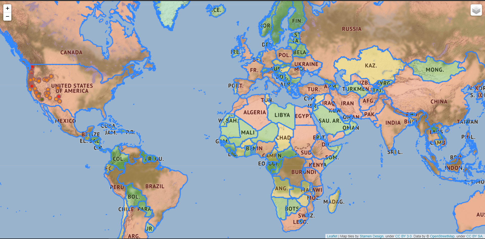
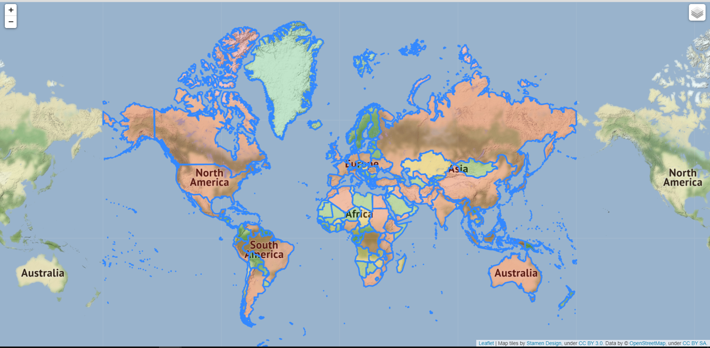
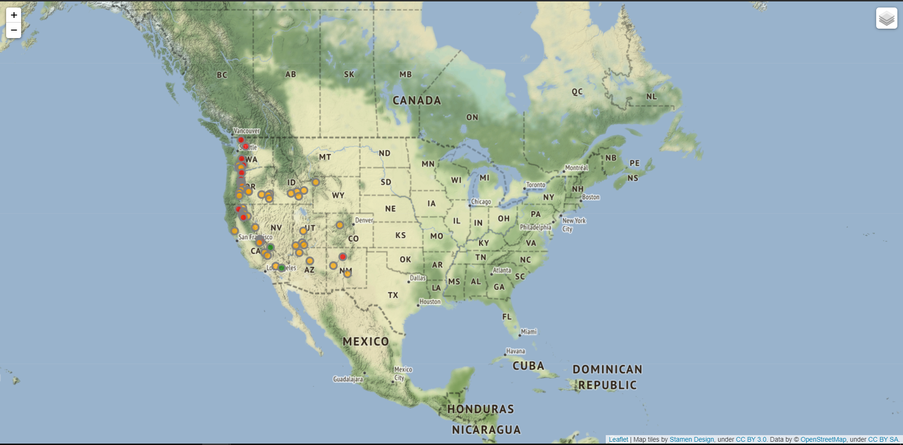

# Python-Applications

This repository contains 10 Python Real World Applications/Projects.   
<b>Idea of Projects</b>  - [The Python Mega Course](https://www.udemy.com/course/the-python-mega-course/)  

***

<b>App1</b>  -  Interactive English Dictionary     &nbsp;&nbsp;&nbsp;&nbsp;&nbsp;&nbsp;&nbsp;&nbsp;&nbsp;&nbsp;&nbsp; In this application, you can find the meaning of any word. If in case you mistyped a word, you'll get the closest word suggestion if you wanted to find the meaning of that word. If this is the word you were looking for, then you'll get the meaning of that word.  

***

<b>App2</b>  -  Volcano & Population Web Map     &nbsp;&nbsp;&nbsp;&nbsp;&nbsp;&nbsp;&nbsp;&nbsp;&nbsp;&nbsp;&nbsp; In this application, if you open the Map4.html file in the browser, you'll see the world map. Initially you'll see the volcanoes that happened in the United States of America as the circles. The colours inside the circles describe the elevation. Also you will see different countries with different colours based on the population of that country(Red - Population > 20000000, Orange - Population in between 20000000 & 10000000, Green - Population < 10000000). At the top right corner, you'll have the option to see particular map.  

        

***

<b>App3</b>  -  Personal Website  
<b>App4</b>  -  Bookshop Database App  
<b>App5</b>  -  Feel-Good Mobile App  
<b>App6</b>  -  Webcam Motion Detector  
<b>App7</b>  -  Real Estate Webscrapper  
<b>App8</b>  -  Interactive Data Dashboard  
<b>App9</b>  -  Database Web App  
<b>App10</b> -  Geocoder Web App
